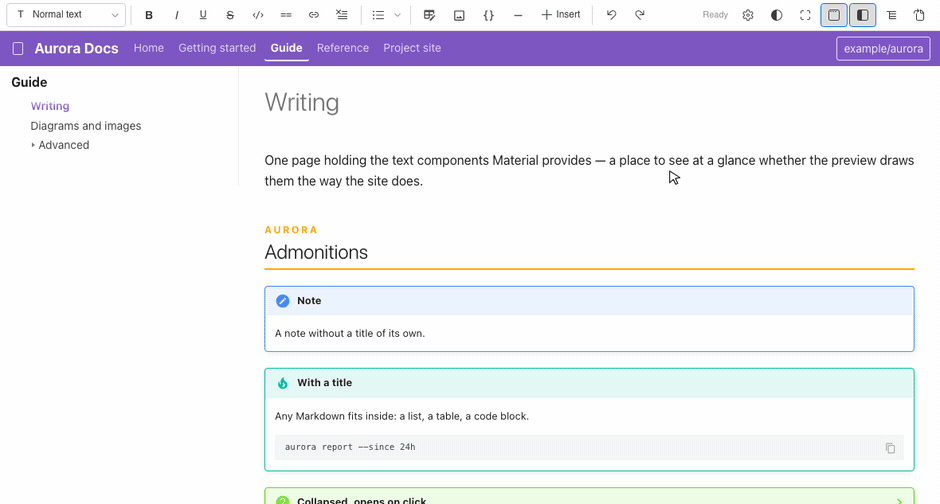
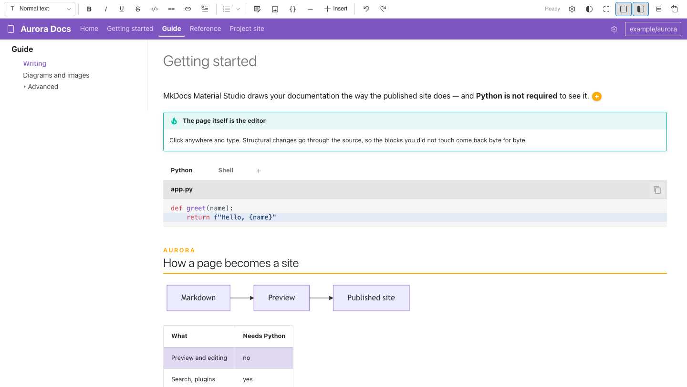
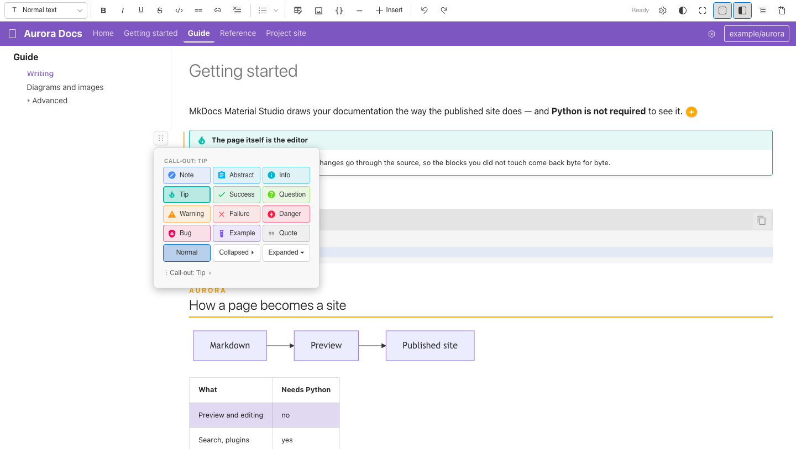
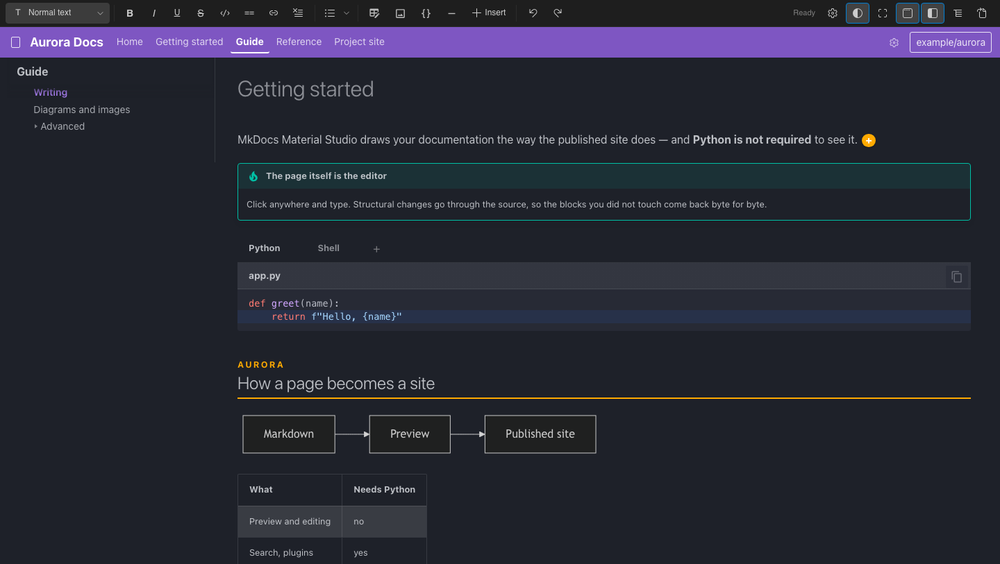

# MkDocs Material Studio

[](https://marketplace.visualstudio.com/items?itemName=azhig.mkdocs-material-studio)
[](https://marketplace.visualstudio.com/items?itemName=azhig.mkdocs-material-studio)
[](LICENSE)

Write **MkDocs Material** documentation the way it will look on the site. A
preview with the real Material styles, editing straight in the rendered page, the
site navigation around it and a form-based editor for `mkdocs.yml` — all inside
VS Code. **Python is not required**: the page is drawn by a built-in engine.



## Features

### The preview looks like the published site

The whole [Material reference](https://squidfunk.github.io/mkdocs-material/reference/)
is drawn: admonitions, content tabs, code blocks with highlighting and line
numbers, tables, Mermaid and PlantUML diagrams, formulas, footnotes, annotations, card grids,
icons and emoji, task lists and definition lists. It updates as you type.

- **Your project's look.** The brand colours of `theme.palette` and the custom
  styles of `extra_css`, with their images and fonts. Save `extra.css` and the
  page updates — no need to reopen the tab.
- **Light or dark follows VS Code**, not `theme.palette.scheme`: a dark editor
  next to a white page is blinding.
- **The type is the system one.** Sizes, weights, colours and the highlighting of
  code are Material's own, down to the variable; the typeface is not. A built
  site fetches Roboto from Google Fonts, and the preview does not reach the
  network at all — so the text is set in the font of your system.
- **Links lead where they do on the site.** A click on `setup.md`, `setup/` or
  `../api` opens that page, `#section` scrolls to the heading, an image or a PDF
  opens in VS Code, an external address in the browser.
- **A copy button** on every code block, and an **“On this page”** panel with the
  section you are reading highlighted as you scroll.
- **Scrolling is synchronized** with the text editor, both ways.
- **Double-clicking an admonition or a code block** opens a form with its
  parameters, and saves only that block.

### Edit the page, not the Markdown

**MkDocs: Open in Visual Editor** — you type in the rendered page. The regular
text editor is untouched; the visual one opens only when you ask for it.



- **Formatting toolbar** — paragraph styles and headings, bold, italic,
  underline, strikethrough, inline code, highlight with a colour choice, links,
  lists (bulleted, numbered, task).
- **The “+” palette** of Material components, with the frequent ones
  pinned to the toolbar. A component is inserted **at the level of the cursor**:
  inside an admonition it nests into it, inside a content tab into that tab.
- **Everything inline is edited by clicking it** — a formula, an image, an icon,
  a key combination, a footnote marker, an abbreviation, a link, a button.
- **An image carries its Material attributes**: width, height and alignment, and
  the colour scheme it belongs to — a light/dark pair (`#only-light` /
  `#only-dark`) is shown the way the site shows it, and the copy of the other
  scheme stays on the page, faded, so it can still be edited.
- **A code block is edited in place**, with live highlighting and line numbers;
  the language and the title live in the block menu.
- **One diagram component for Mermaid and PlantUML**, with language-specific
  templates, live preview and source editing.
- **Tables**: `Tab` and `Shift+Tab` move between cells, `Enter` moves down; a
  floating menu adds rows and columns and sets alignment.
- **Pasting from a browser or an office editor is sanitized** — headings, lists,
  tables and code survive; foreign fonts, colours and service glyphs do not.
- **Dragging by the handle** to the left of a block changes the order; a line
  shows where it will land, `Esc` cancels.



> **Your file is safe.** Only the block you changed is written; everything else
> stays byte for byte as it was, so “opened and closed” never shows up in git.
> Raw HTML, inline footnotes (`^[…]`) and `::: identifier` blocks are marked
> “as text only” and are never rewritten.

### The site around the page

Two buttons — **Header** and **Navigation** — put the site around what you are
reading: the logo, the name, the section tabs and the repository link on top, the
page list from `nav` on the left. Clicking a page opens it right there. Sections
collapse, the current page is highlighted, and the state is remembered.

The **MkDocs panel** in the explorer shows the same navigation plus a “not in
navigation” section — pages in `docs/` that `nav` does not mention. Creating,
renaming, deleting and dragging pages there edits `mkdocs.yml` surgically:
comments and formatting are preserved.

A nav entry of the form `Library: '!include ./lib/mkdocs.yml'`
(mkdocs-monorepo-plugin) is followed: the included config becomes a section whose
pages come from its own `docs_dir`, its `site_name` is their URL prefix, and an
`extra_css` entry written as `lib/stylesheets/extra.css` is read from
`lib/docs/stylesheets/`. Opening a page of a section shows the whole site around
it, not just that section.

### `mkdocs.yml` without writing YAML

Tabs _General / Theme / Features / Plugins / Extensions_ — fields, swatches of
the real palette colours, and toggles for theme features, plugins and Markdown
extensions. Every change rewrites a single line; the rest of the file is left
alone.

Three ways in: the **gear in the site header** of the visual editor, the **gear
on the preview toolbar**, or the **gear on the MkDocs panel**. In a monorepo the
one that opens is the config the current page belongs to — the nearest
`mkdocs.yml` up the tree.

### Components in the plain text editor

**MkDocs: Insert Material Component** fills a form and writes the markup at the
cursor of a regular Markdown editor — no visual mode needed. For icons there is
a search over 14,000+ Material, FontAwesome, Simple Icons and Octicons glyphs.

| You pick      | It writes                                                       |
| ------------- | --------------------------------------------------------------- |
| Admonition    | `!!! note "Title"`, or `???` / `???+` when collapsible          |
| Content tabs  | `=== "Tab 1"` blocks with the body indented under each          |
| Code block    | ` ```python title="setup.py" hl_lines="2 3" `                   |
| Button        | `[Text](https://example.com){ .md-button .md-button--primary }` |
| Keyboard keys | `++ctrl+alt+del++`                                              |
| Footnote      | `[^1]` at the cursor and `[^1]: the text` below                 |
| Abbreviation  | `*[HTML]: HyperText Markup Language`                            |
| Snippet       | `--8<-- "shared/intro.md"`                                      |

### Dark theme

The page follows the VS Code theme, and the toolbar button overrides it until you
switch back. Both schemes take their colours from `theme.palette` in your
`mkdocs.yml`.



### Interface language

English by default. `mkdocsStudio.language` switches the panels to **English,
Deutsch, Español, Français, Português (Brasil), 简体中文** or **日本語**; `auto`
follows the display language of VS Code. The change applies immediately.

Command names in the command palette and the setting descriptions are translated
by VS Code itself, so those follow **its** display language rather than this
setting.

## Getting started

1. Install from the Extensions view (`Cmd/Ctrl+Shift+X`), or run
   `ext install azhig.mkdocs-material-studio` in the command palette. Every
   release also attaches a `.vsix` to the
   [releases page](https://github.com/azhig/mkdocs-material-studio/releases) —
   install it with `code --install-extension <file>.vsix`.
2. Run **Developer: Reload Window** after installing, so VS Code picks up the
   extension settings.
3. Open the folder with your documentation. The project is found by `mkdocs.yml`
   (or `mkdocs.yaml`), which may live in a nested directory.
4. Open a `.md` file and click the **book icon** in the editor's top-right
   corner — the preview opens as a full tab. Hold `Alt` to put it side by side
   with the text instead.
5. To edit visually: `Cmd/Ctrl+Shift+P` → **MkDocs: Open in Visual Editor**.

## Requirements

None. No Python, no `mkdocs` installation, no local server — the preview is
rendered by the extension itself.

Mermaid and PlantUML are rendered locally by browser-native JavaScript engines.
Diagram source never leaves VS Code, and neither Java nor a network connection
is required.

Two things about PlantUML are worth knowing. The published site draws these
fences with a plugin of its own (`plantuml-markdown`, `mkdocs-kroki` or
similar) — the extension shows the picture whether or not the site is set up
for it. And the bundled engine is the core one: sprite libraries (AWS, tupadr3,
material), `<:emoji:>` and `<&openiconic>` icons are not part of it, and a
diagram that is not in this release is answered with a “not supported” picture
rather than an error.

The extension does not run `mkdocs serve` and does not manage a server. To see
the built site with search, plugins and `mkdocstrings`, run `mkdocs serve` in the
terminal and open it in a browser.

## Commands

All of them live under the **MkDocs** category in the command palette.

| Command                         | What it does                                               |
| ------------------------------- | ---------------------------------------------------------- |
| Open Preview                    | The preview as a full tab, following the current file      |
| Open Preview to the Side        | The classic split: text on one side, the page on the other |
| Open in Visual Editor           | Editing inside the rendered page                           |
| Open as Text (Markdown)         | Back to the plain editor (button in the visual editor)     |
| Insert Material Component       | The component palette for the plain editor                 |
| MkDocs Settings (Visual Editor) | The form-based `mkdocs.yml` editor                         |
| Open mkdocs.yml as Text         | The config in the plain YAML editor                        |
| New Page                        | A page in `docs/`, added to `nav`                          |
| New Section                     | A section in `nav`                                         |
| Rename                          | Renames a page and its `nav` entry (tree menu)             |
| Delete                          | Deletes a page and its `nav` entry (tree menu)             |
| Refresh Tree                    | Re-reads `mkdocs.yml` and the pages                        |
| Show Log                        | The extension log — start here when something looks wrong  |

## Keyboard shortcuts

In the visual editor. `Cmd` on macOS, `Ctrl` elsewhere.

| Action                          | Shortcut                                      |
| ------------------------------- | --------------------------------------------- |
| Bold / italic / underline       | `Cmd+B` · `Cmd+I` · `Cmd+U`                   |
| Strikethrough / code            | `Cmd+Shift+S` · `Cmd+Shift+M`                 |
| Link / clear formatting         | `Cmd+K` · `Cmd+Shift+\`                       |
| Undo / redo                     | `Cmd+Z` · `Cmd+Shift+Z`                       |
| Normal text, headings 1–6       | `Cmd+Alt+0` … `Cmd+Alt+6`                     |
| Bulleted / numbered / task list | `Cmd+Shift+8` · `Cmd+Shift+7` · `Cmd+Shift+6` |
| Quote                           | `Cmd+Shift+9`                                 |
| Insert a component              | `Cmd+Alt+` a letter — see below               |
| Quick insert                    | `/` in an empty paragraph                     |
| Select the block, then around   | `Esc`, again for its container                |
| Copy / cut that block           | `Cmd+C` · `Cmd+X` with nothing selected       |

Component letters: `T` table, `P` image, `C` code, `D` divider, `A` admonition,
`Shift+T` content tabs, `E` icons and emoji, `G` grid, `M` diagram, `B` button,
`N` annotation, `F` footnote, `K` tooltip, `Q` formula.

Any of them can be reassigned: the **gear** on the toolbar → **Keyboard
shortcuts**. Click a shortcut and press a new one; `Backspace` disables it.
That popup, not VS Code's own **Keyboard Shortcuts** editor, is where these
live.

While the visual editor has focus these combinations belong to it, so `Cmd+B`
makes text bold instead of collapsing the side bar. Only the ones in the list
are taken: everything else — saving, find, the command palette — reaches VS
Code untouched, and a shortcut you reassign hands its old key straight back.

## Extension settings

| Setting                              | Default                     | What it does                                                                                         |
| ------------------------------------ | --------------------------- | ---------------------------------------------------------------------------------------------------- |
| `mkdocsStudio.language`              | `auto`                      | Interface language of the panels; `auto` follows VS Code                                             |
| `mkdocsStudio.followActiveEditor`    | `true`                      | The preview follows the active Markdown editor                                                       |
| `mkdocsStudio.scrollSync`            | `true`                      | Synchronized scrolling between the editor and the preview                                            |
| `mkdocsStudio.showSiteHeader`        | `false`                     | Show the site header; the **Header** button toggles it                                               |
| `mkdocsStudio.showSiteNav`           | `false`                     | Show the page list on the left; the **Navigation** button toggles it                                 |
| `mkdocsStudio.showToc`               | `false`                     | Show the “On this page” panel; the **Contents** button toggles it                                    |
| `mkdocsStudio.pageBackground`        | `material`                  | `material` — the colour of the Material scheme; `editor` — the VS Code theme's background            |
| `mkdocsStudio.palette.light.primary` | _unset_                     | Primary colour of the light scheme; `theme.palette` in `mkdocs.yml` wins, unset keeps Material's own |
| `mkdocsStudio.palette.light.accent`  | _unset_                     | Accent colour of the light scheme — links and active elements                                        |
| `mkdocsStudio.palette.dark.primary`  | _unset_                     | Primary colour of the dark (`slate`) scheme                                                          |
| `mkdocsStudio.palette.dark.accent`   | _unset_                     | Accent colour of the dark scheme                                                                     |
| `mkdocsStudio.imagePasteFolder`      | `assets`                    | Where pasted and dropped images are saved, relative to the current file                              |
| `mkdocsStudio.inlineFormatting`      | `both`                      | Where formatting appears: `selection`, `toolbar` or `both`                                           |
| `mkdocsStudio.toolbarButtons`        | table, image, code, divider | Components pinned to the visual editor toolbar                                                       |
| `mkdocsStudio.keybindings`           | `{}`                        | Shortcut overrides; only the differences from the defaults are stored                                |

An example for `settings.json` — a German interface, images kept in `images/`
next to the page, and formatting shown only on a selection:

```jsonc
{
  "mkdocsStudio.language": "de",
  "mkdocsStudio.imagePasteFolder": "images",
  "mkdocsStudio.inlineFormatting": "selection",
  "mkdocsStudio.showSiteNav": true,
  "mkdocsStudio.palette.dark.accent": "amber",
}
```

Shortcuts are written the same way the editor stores them — `mod` is `Cmd` on
macOS and `Ctrl` elsewhere, an empty string turns one off:

```jsonc
{
  "mkdocsStudio.keybindings": {
    "insert.admonition": "mod+alt+w",
    "format.underline": "",
  },
}
```

## Without `mkdocs.yml`

The extension works in a plain repository too. With no config the **Navigation**
button shows a **Markdown registry**: every `.md` file in the workspace, skipping
`node_modules`, `dist`, `site`, `vendor` and other service directories. Titles
come from the first `H1`, and the order from the directory's table of contents —
`SUMMARY.md`, otherwise `README.md` or `index.md`, then everything else
alphabetically. No file is lost, even when nothing links to it.

## Troubleshooting

**A `::: identifier` block shows a card instead of the reference.** Those pages
are assembled by the `mkdocstrings` Python plugin when the site is built. Run
`mkdocs serve` and read that page in a browser.

**Project colours and styles are missing.** Check where `mkdocs.yml` is:
it is searched for across the workspace, but `node_modules`, `site`, `dist`,
`build`, `vendor` and `.venv` are skipped. In a monorepo, a page uses the nearest
config up the tree.

**Buttons do not respond, or settings are not saved.** Run **Developer: Reload
Window** after updating the extension.

**Nothing happens in a restricted window.** The extension reads your
`mkdocs.yml`, the files your pages include and your stylesheets, so it needs a
workspace you trust — **Workspaces: Manage Workspace Trust**. For the same reason
a link opens externally only when it is `http`, `https` or `mailto`, and an
include (`--8<--`) is read only from inside the project.

**Something rendered incorrectly.** Open **MkDocs: Show Log** — it says which
config was read and what failed to load.

## Release notes

See [CHANGELOG.md](CHANGELOG.md).

## Contributing

Bug reports and pull requests are welcome — start with
[CONTRIBUTING.md](CONTRIBUTING.md). Found a security problem? Please report it
privately, see [SECURITY.md](SECURITY.md).

## License

MIT — see [LICENSE](LICENSE). Material styles and icons come from the
[mkdocs-material](https://github.com/squidfunk/mkdocs-material) package (MIT);
third-party components are listed in
[THIRD_PARTY_NOTICES.md](THIRD_PARTY_NOTICES.md). This extension is not
affiliated with the MkDocs or MkDocs Material projects.
