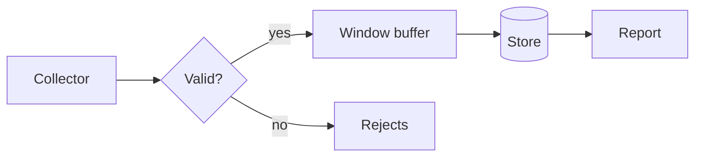
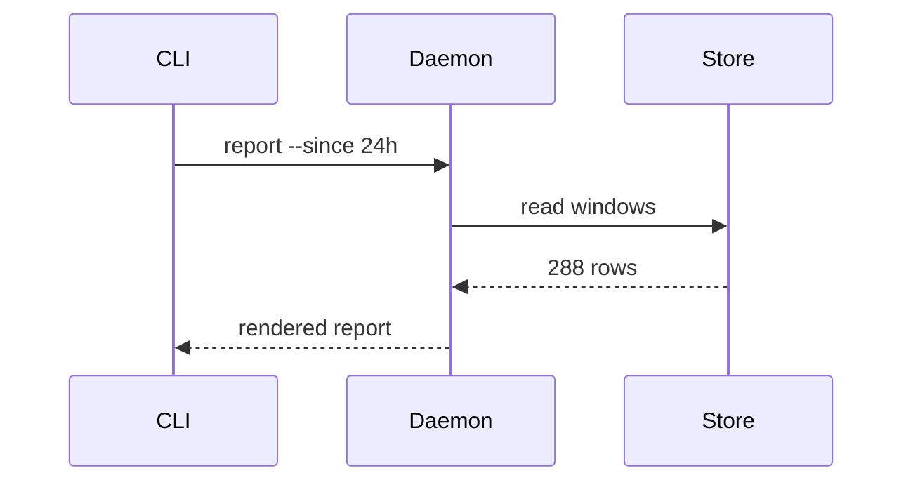
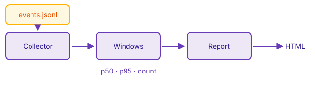

# Diagrams and images

## How events travel



The picture is drawn by Mermaid inside the preview and follows the page scheme:
switch the VS Code theme and it is redrawn.



## A picture from the repository



A local file resolved against the page — the same as the site does.

<figure markdown>
  { width="320" }
  <figcaption>A figure with a caption</figcaption>
</figure>

## One picture per color scheme

{ width="320" }
{ width="320" }

The anchor of the address decides which copy the page shows; switching the
scheme swaps them. The editor keeps both on the page, the hidden one faded, so
the pair can be edited from one place.

## Formulas

The percentile of a window is taken over the sorted durations:

$$
p_{95} = x_{\lceil 0.95\,n \rceil}
$$

Inline as well: the number of windows in a day is $n = 86400 / w$, where $w$ is
the window in seconds.

## A code block with line numbers

```python title="window.py" linenums="1" hl_lines="6 7"
def percentile(values: list[float], q: float) -> float:
    if not values:
        raise ValueError("empty window")
    ordered = sorted(values)
    index = math.ceil(q * len(ordered)) - 1
    # The index is clamped: q = 1.0 must not walk off the end.
    return ordered[min(index, len(ordered) - 1)]
```

Next: [annotations](advanced/annotations.md).
